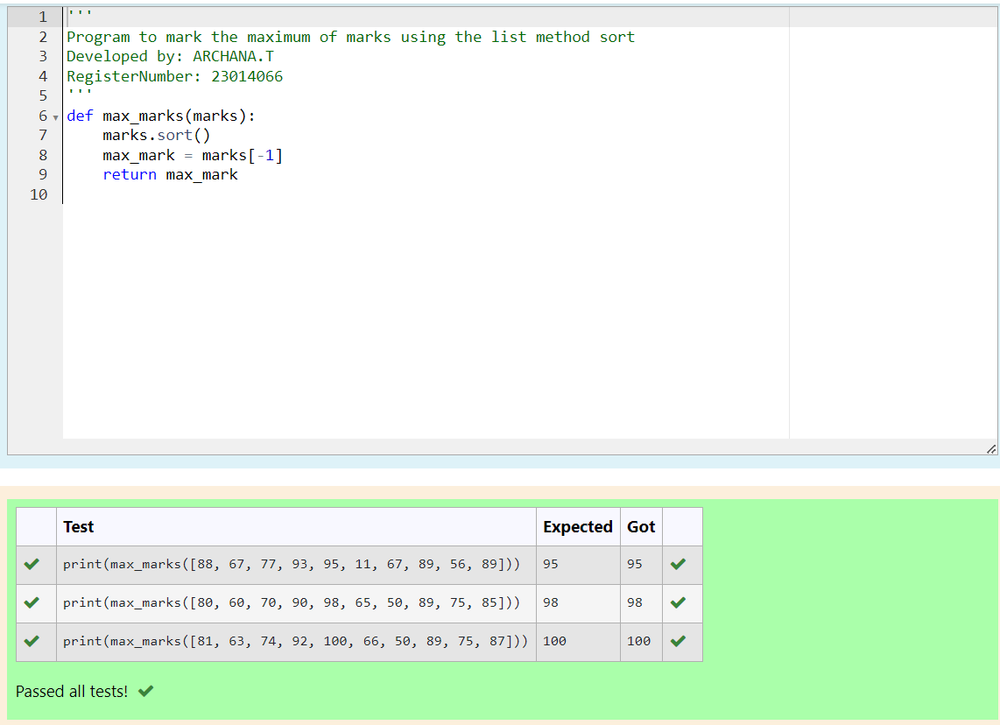
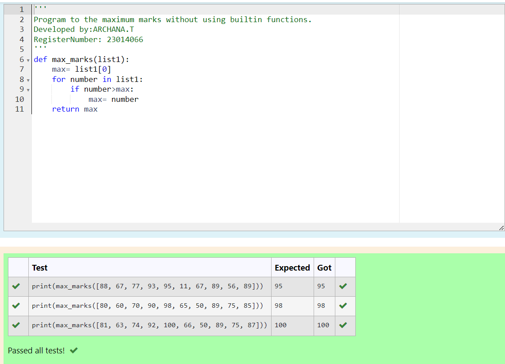

# Find the maximum of a list of numbers
## Aim:
To write a program to find the maximum of a list of numbers.
## Equipment’s required:
1.	Hardware – PCs
2.	Anaconda – Python 3.7 Installation / Moodle-Code Runner
## Algorithm:
1.	Get the list of marks as input
2.	Use the sort() function or max() function or use the for loop to find the maximum mark.
3.	Return the maximum value
## Program:

i)	# To find the maximum of marks using the list method sort.
1. def max_marks(marks):
2. marks.sort()
3. max_marks = marks[-1]
4. return max_mark
ii)	# To find the maximum marks using the list method max().
1. def max_marks(marks):1
2. return(max_marks)
iii) # To find the maximum marks without using builtin functions.
1. def max_marks(list):
2. max_list[0]
3. for number>max:
4. max_number
5. return max   
## Output

## Result:
Thus the program to find the maximum of given numbers from the list is written and verified using python programming.

